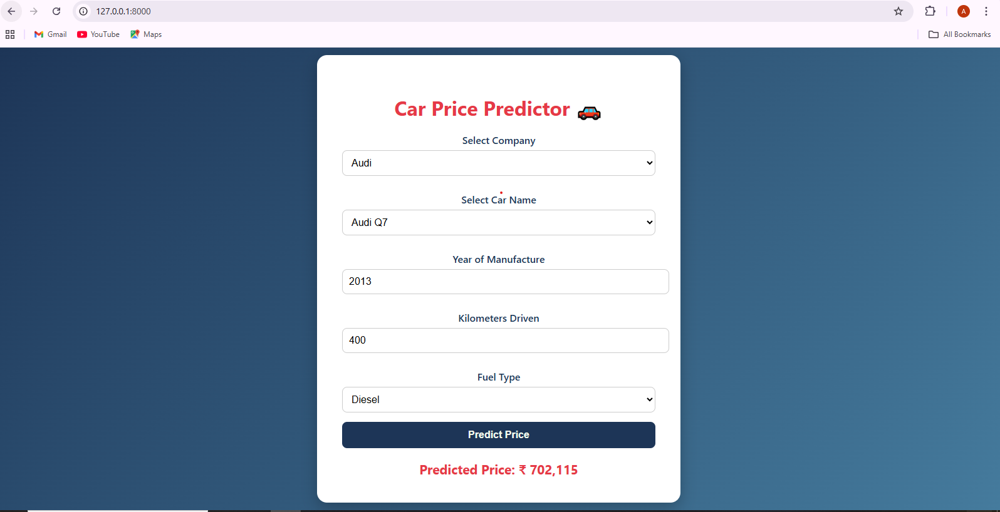

# 🚗 Car Price Predictor  

This is my **Car Price Prediction Project** where I built an end-to-end system using **Machine Learning, FastAPI, HTML/CSS frontend, and Docker**.  

## 📌 Project Overview  
- Collected and cleaned car price dataset.  
- Built a **Machine Learning model (XGBoost/Decision Tree, etc.)** to predict car prices.  
- Achieved **92% accuracy** on test data.  
- Created a **FastAPI backend** for serving predictions as an API.  
- Designed a **simple frontend (HTML, CSS)** for users to input car details.  
- Containerized the project using **Docker** and pushed it to **DockerHub**.  

## 🛠️ Tech Stack  
- **Python** (Pandas, NumPy, Scikit-learn, XGBoost)  
- **FastAPI** (for API backend)  
- **HTML, CSS** (for frontend)  
- **Docker** (for containerization)  

## ⚙️ How It Works  
1. User enters car details (brand, year, mileage, etc.) in the frontend form.  
2. Data is sent to the **FastAPI backend**.  
3. Backend loads the **trained model (`.pkl` file)**.  
4. Model predicts the car price and sends it back to the frontend.  
5. Result is displayed on the webpage.  

## 🚀 Installation & Run Locally  
```bash
# Clone this repository
git clone https://github.com/your-username/car-price-predictor.git

# Navigate to project folder
cd car-price-predictor

# Install requirements
pip install -r requirements.txt

# Run FastAPI
uvicorn app:app --reload
```
Then open: http://127.0.0.1:8000/

🐳 Run with Docker
# Build Docker image
docker build -t car-price-predictor .

# Run container
```bash
docker run -p 8000:8000 car-price-predictor
```
# 📊 Model Performance

Accuracy: 92%

Evaluation metric: R² Score

# 📷 Screenshots

### Frontend Form  
  

# 🙌 Acknowledgements

Thanks to open datasets from Kaggle / UCI.

Inspired by real-world car price prediction use cases.
